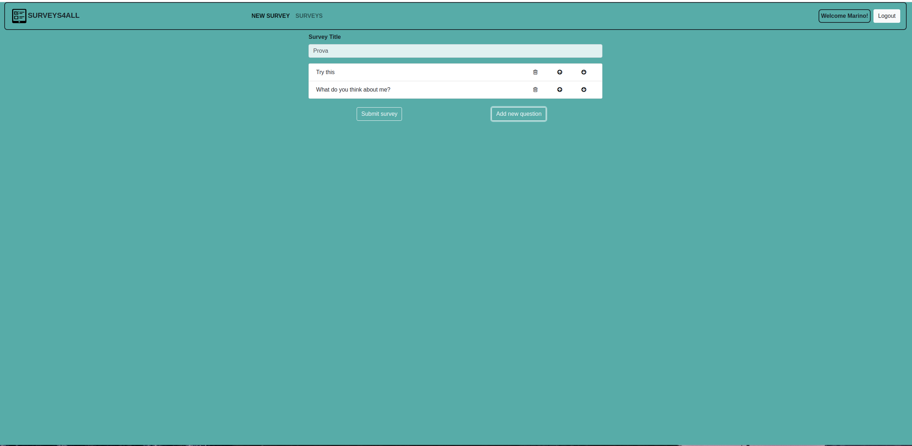
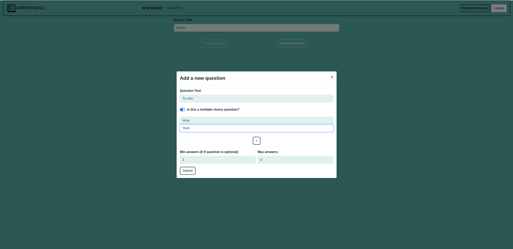
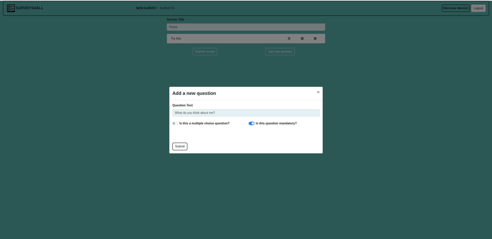

# Exam #1: "Questionario"
## Student: s290159 CARMOLLINGO ANGELO MARINO 


## React Client Application Routes

- Route `/`: home page where the user can see the surveys. If the user is a logged in admin, he will see only his surveys.
- Route `/login`: login page where an admin can log in.
- Route `/newsurvey`: survey creation page only accessible by logged in admin.
- Route `/showanserws/:id`: page accessible only by a logged in admin to see the answers given by the users to the survey with id=`id`. Parameter `id` represents the unique identifier of a survey in the Database;
- Route `/surveys/:id`: page accessible only by a user and not by a logged in admin to see and submit the survey with id=`id`. rameter `id` represents the unique identifier of a survey in the Database.


## API Server

- POST `/api/surveys`
  - Request parameters: None.
  - Response body: None.
  - Response: `200 OK` (success), `400 Bad Request` (wrong request format) or `500 Internal Server Error` (generic database error).
  - Request body (with brief description of the fields): 
```
{
  "admin": adminID,
  "title": "Survey title goes here",
  "closequest": [{
                    "text": "Multiple Choice Question text goes here",
                    "min": "Minimum number of answers",
                    "max": "Maximum number of answers",
                    "order": "Number of order of the question in the survey",
                    "answers": [{
                                  "text": "Answer text goes here"
                                 }, 
                                 ...
                               ]
                  },
                  ...
                  ],
    "openquest": [{
                      "text": "Open Question text goes here",
                      "optional": optionality (1 is optional, 0 is mandatory),
                      "order": "Number of order of the question in the survey"
                  },
                 ...
                 ]
}
```


- POST `/api/submissions`
  - Request parameters: None.
  - Response body: None.
  - Response: `200 OK` (success), `400 Bad Request` (wrong request format) or `500 Internal Server Error` (generic database error).
  - Request body (with brief description of the fields): 
```
{
  "username": "Username goes here",
  "id": surveyID,
  "closequest": [{
                    "id": closequestID,
                    "answers": [{
                                  "id": answerID
                                 }, 
                                 ...
                               ]
                  },
                  ...
                  ],
    "openquest": [{
                      "id": openquestID,
                      "answer": "Answer to the question goes here"
                  },
                 ...
                 ]
}
```


- GET `/api/surveys/:id`
  - Request parameters: `id` represents the identifier of the survey to be retrieved.
  - Request body: None.
  - Response: `200 OK` (success), `404 Not Found` (survey not found in the database) or `500 Internal Server Error` (generic database error).
  - Response body (with brief description of the fields): 
```
{
  "id": surveyID,
  "title": "Survey title goes here",
  "numsubs": numberOfSubmissions,
  "closequest": [{
                    "id": closequestID,
                    "text": "Multiple Choice Question text goes here",
                    "min": "Minimum number of answers",
                    "max": "Maximum number of answers",
                    "order": "Number of order of the question in the survey",
                    "closed": 1 (Always because 1 represents the closed questions),
                    "answers": [{
                                  "id": answerID,
                                  "text": "Answer text goes here"
                                 }, 
                                 ...
                               ]
                  },
                  ...
                  ],
    "openquest": [{
                      "id": openquestID,
                      "text": "Open Question text goes here",
                      "optional": optionality (1 is optional, 0 is mandatory),
                      "order": "Number of order of the question in the survey",
                      "closed": 0 (Always because 0 represents the open questions)
                  },
                 ...
                 ]
}
```


- GET `/api/surveys`
  - Request parameters: None.
  - Request body: None.
  - Response: `200 OK` (success), `404 Not Found` (no surveys found in the database) or `500 Internal Server Error` (generic database error).
  - Response body (with brief description of the fields): 
```
[{
  "id": surveyID,
  "title": "Survey title goes here",
  "admin": adminID
  "numsub": numberOfSubmissions
},
...
]
```


- GET `/api/submissions/:id`
  - Request parameters: `id` represents the identifier of the survey of which submissions has to be retrieved.
  - Request body: None.
  - Response: `200 OK` (success), `404 Not Found` (no submissions found for that survey) or `500 Internal Server Error` (generic database error).
  - Response body (with brief description of the fields):
```
    {
      "id": submissionID,
      "user": "Username goes here",
      "closequest": [{
                        "id": closequestID,
                        "closed": 1 (Always because 1 represents the closed questions),
                        "answer": answerID
                       },
                      ...
                      ],
        "openquest": [{
                          "id": openquestID,
                          "closed": 0 (Always because 0 represents the open questions),
                          "answer": "Answer given by the user goes here"
                      },
                     ...
                     ]
    }
```


- POST `/api/sessions`
  - Request parameters: None.
  - Response: `200 OK` (success) or `401 Not Authenticated` (admin not found in the db or wrong credentials).
  - Request body (with brief description of the fields): 
```
{
  "username": "Admin username goes here",
  "password": "Admin password goes here"
}
```
   - Response body (with brief description of the fields):
```
{
  "id": adminID,
  "username": "Admin username goes here"
}
```
 


- DELETE `/api/sessions/current`
  - Request parameters: None.
  - Request body: None.
  - Response body: None.


- GET `/api/sessions/current`
  - Request parameters: None.
  - Request body: None.
  - Response: `200 OK` (success) or `401 Not Authenticated` (admin not found in the db or wrong credentials).
  - Response body (with brief description of the fields):  
```
{
  "id": adminID,
  "username": "Admin username goes here"
}
```


## Database Tables

- Table `Administrators` - contains ID, Username and Password of an administrator;
- Table `Surveys` - contains ID, AdminID, Title and NumSubmissions of every created survey; [AdminID refers to Administrators.ID]
- Table `Submissions` - contains ID, Username and SurveyID of every submission made by a user; [SurveyID refers to Surveys.ID]
- Table `OpenQuestions` - contains ID, SurveyID, QuestionText, isOptional and OrderNumber of every open question for every created survey; [SurveyID refers to Surveys.ID]
- Table `MultipleChoiceQuestions` - contains ID, SurveyID, QuestionText, MaxAnswers, MinAnswers, OrderNumber of every multiple choice question for every created survey; [SurveyID refers to Surveys.ID]
- Table `MultipleChoiceAnswers` - contains ID, QuestionID and AnswerText of every possible answer for each multiple choice question in the database; [QuestionID refers to MultipleChoiceQuestions.ID]
- Table `UserOpenQuestionsSubmissions` - contains SubmissionID, QuestionID and Answer for every submission made by each user to the submitted survey open questions; [SubmissionID refers to Submissions.ID, QuestionID refers to OpenQuestions.ID]
- Table `UserMultipleChoiceAnswers` - contains SubmissionID, QuestonID and AnswerID for every submission made by each user to the submitted survey multiple choice questions; [SubmissionID refers to Submissions.ID, QuestionID refers to MultipleChoiceQuestions.ID, AnswerID refers to MultipleChoiceAnswers.ID]


## Main React Components

- `CustomNavbar` (in `./client/src/components/CustomNavbar.js`): this component is the customized navbar for the app; it shows the logo, name and menu of the app and the buttons to login/logout.
- `LoginForm` (in `./client/src/components/LoginForm.js`): this component is the login form used by admins to log in the app;
- `NewSurvey` (in `./client/src/components/NewSurvey.js`): this component cooperates with the minor component `NewQuestion` (in `./client/src/components/utils/NewQuestion.js`) to allow admins to create a new survey. It's a Form with a Modal (NewQuestion) to add questions to a survey, the Form also contains a ListGroup to manage (order and delete) the questions;
- `Survey` (in `./client/src/components/Survey.js`): this component shows to a user the survey he had chosen in the home to be submitted. It's made by a Form with the cooperation of the components MultipleChoiceQuestion (in `./client/src/components/utils/MultipleChoiceQuestions.js`) and OpenQuestions (in `./client/src/components/utils/OpenQuestion.js`) that renders the multiple choice and the open questions respectively;
- `SurveysTable` (in `./client/src/components/SurveysTable.js`): this component shows the list of surveys with a link to submit a survey (user) or a link to view the submissions made by users to that survey (admin). Admin can only see his surveys. A survey is rendered as a TableRow (in `./client/src/components/SurveysTable.js`) that is a Card component showing the informations;
- `ViewUserAnswers.js` (in `./client/src/components/ViewUserAnswers.js`): this component shows the answers given to a survey by the users. It's accessible only by admins and shows the answers of the selected survey (via Link in Card body of component TableRow). It renders UserAnswer component (in `./client/src/components/utils/UserAnswer.js`) that renders a Pagination with a Form for each page containing the answers for each user to the selected survey. There are as many pages as the number of submissions to that survey.


## Screenshot

To be more precise, I've decided to upload the screenshots of the insertion of a Multiple Choice Question, of an Open Question and of a Survey in general (there's no visual distinction after inserion of a question between multiple choice ones and open ones).











## Users Credentials

|Username|Password|Surveys|
|---|---|---|
|Marino|Marino|Breaking Bad, How I Met Your Mother, The Simpsons|
|Pjnpy|Pjnpy|The Big Bang Theory, Game of Thrones|
